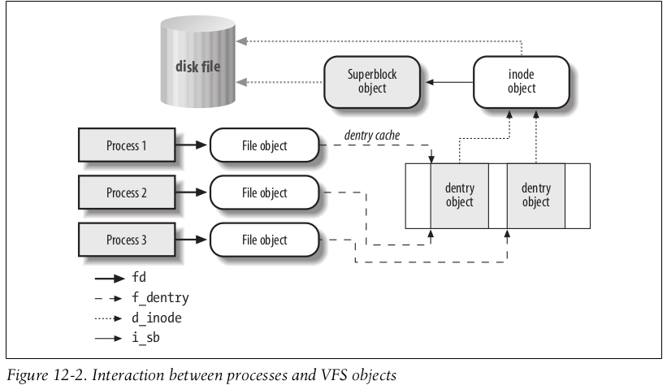

# What happens in the kernel when you open a file?

Each process has a data structure called the "file table" that contains info about opened files. The table is indexed by "file descriptors". Using file descriptor, process may query "pointer to inode". Each process has 3 predefined file descriptors: stdin (0), stdout(1), stderr(2). A child process inherit the file table, i.e. file descriptors are also inherited.

stdio refers to keyboard inputs. stdout and stderr refers to your screen.

## Understanding the kernel's data structure 

The open syscall is invoked via a trap. In the C library, the open() function is a wrapper of the syscall, at some point, it runs the `int x80` instruction which stands for interrupt and find the interrupt handler table at memory address `x80`. Then this handler function will load the syscall number from a register, and find the corresponding syscall service routine in the syscall table. Then the kernel does its real job.

To know what data structure is created in memory when opening a file, we first need to know what data structure is pre-existed. Let's introduce VFS. VFS is an abstraction layer of all types of filesystems. In essense, in every opened file, it has an in-memory info struct, which contains a pointer to a struct `f_op`, which contains function pointers to the actual implementation of file operations (open,close,read,write).

`file->f_op->read(...)`.

This is a C-style object interface. When opening a file, the kernel should assign proper function pointers according to the actual filesystem that the file resides in.

In VFS, there are usually 4 types of objects working together:
- superblock: info of a mounted filesystem, it refers to a `filesystem control block` on disk for disk-based filesystem (CD, harddisk, USB...)
- inode: info of a file. It refers to `file control block` on disk for disk-based filesystem. It has a unique number across filesystem.
- file: info about opened file and a process. Exists in memory. (This is the object created by `open()`!)
- dentry: stores a hard link. On disk. Formats differ per filesystem.

- A process recognises the file object with a `file descriptor`.
- The file object specify the dentry object via `f_dentry` field. This tells which hard link was used to open the file.
- The dentry object should contain the file name and the corresponding inode number `d_inode`. (How it knows which filesystem the inode number belongs to?)
- The inode object contains pointer to superblock object and the disk file.

Side notes: opening a file with a deeper path will require loading more dentry objects from disk to memory. This is optimized by dentry cache, which is a kind of disk cache (cache in RAM for something in disk).

This article serves a good intro: https://developer.ibm.com/tutorials/l-linux-filesystem/.

### Superblock object

1 filesystem 1 superblock. Disk based filesystem stores it on special sector. Virtual filesystem stores it in memory. All superblocks are linked in circular linked list.

Superblock operations includes:
- alloc_inode (allocate memory for an empty inode object)
- destroy_inode (release memory)
- read_inode (fill in empty inode object with data on disk)
- write_inode (write the inode back to memory, can be sync or async)
- put_super (release the superblock object, as the filesystem is unmounted)
...

They are all function pointers, so each filesystem has its own implementation.

It stores a list of its own inodes, in `s_inodes`.

### inode object

It's lifecycle is same as a file. It's in-memory copy is controlled by a counter, counting on how many `file` object pinning it. If no process is opening this file, this inode can be released.

All inodes must exist in 1 of the 3 circular doubly linked lists:
- disk cache: disk mirrors of inodes with `i_count == 0`.
- in-use: disk mirrors of inodes with `i_count > 0`.
- dirty: `i_state & I_DIRTY > 0`. Some changes has been made in memory but not written to disk.

They are mutually exclusive, thus only 1 pair of pointers are needed for each inode to store their neighbors `i_list`.

The inodes are grouped by filesystems, they also form a circle. `i_sb_list` stores neighbor in this circle.

Another way to find this inode is via the inode_hastable. `hash(inode number, superblock address) -> index of inode address`. `i_hash` field is the collision list neighbors in this hash table.

The inodes also have a number of operations:
- about dentry linking
- about symbolic link
- directory operation (mkdir, rmdir)
- file attributes and permissions
- file operatios function pointers

### file object

Resides in memory only. Here we can find many familiar fields related to file I/O.
- f_op
- f_count
- f_flags (flags when opening a file)
- f_mode (process access mode)
- f_pos (current file offset, which is the file pointer)
- f_uid
- f_gid

File objects are allocated in a memory place called filp, which is a slab cache. It has a descriptor address stored in a filp_cachep variable. This cache has a size limit, so there is an upperbound for number of opened file in linux system.

Learn more about slab: https://www.cnblogs.com/binlovetech/p/17288990.html

All opened file objects are referenced by its superblock in a circular linked list. Interesting fact is there is a spin lock `files_lock` which protects the list against concurrent accesses in multiprocessor systems. (Does it means that processes cannot perform file I/O, which may access the file object, in parallel?)

A misconception is that 1 file object is used by exactly 1 process. But in Linux, lightweight process created with CLONE_FILES flag can shared the file object.

## How is a file opened?

When the open syscall finally reached the VFS part, it invokes `get_empty_filp` function to allocate a new file object:

- create zerolised memory block 
- init some list for epoll and lock
- set f_count to 1 
- set f_uid and f_gid as current->fsuid and current->fsgid (current points to the current process), this means the user and group identity that the process will use to access the file system. Those are initialized as the process real user id (uid, who start the process) and real group id of the user. File permission is checked against these 2 fields.
- set f_op field according to the inode i_fop field

## How a process get access to a file system?

A process has a struct in kernel memory called `process descriptor`. There is a `fs` field pointing to another struct.

fs_struct:
- count: number of process sharing this table
- lock : a read write lock of this struct
- umask : a file permission mode filter used by this process. to avoid the process from requesting too much permission
- root : the root namespace that this process think of
- pwd  : the current working directory
- rootmnt: the filesystem mounted by process root
- pwdmnt: the filesystem mounted by current working directory

`rootmnt` and `pwdmnt` are struct in type `vfsmount`. This struct contains a list of superblocks of the filesystem in field `mnt_sb`. Multiple superblock is mainly for fault tolerance and redundancy. This allows the process to access the superblock of all directory visible to it.

The file descriptor table is stored in another struct: `files_struct`, which manages the next file descriptor values, max fd, etc. It contains an array of the file objects, indexed by the file descriptor.

Note that 2 file descriptors can refer to the same file object (therefore stderr can also be seen in terminal).